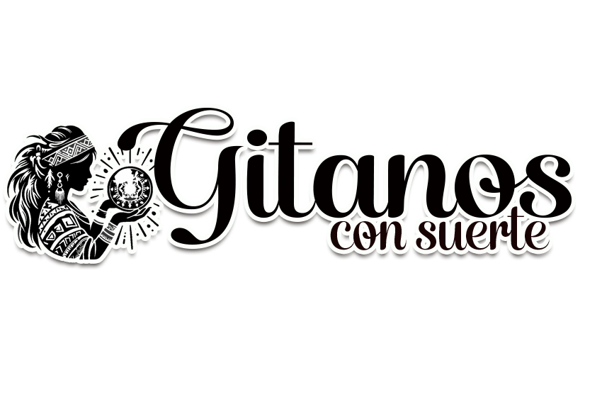

<header>
  <h1>LA SUERTE TE ESTÁ ESPERANDO</h1>
</header>

  

    
Somos tu equipo en Paita para organizar <strong>sorteos</strong>, <strong>eventos corporativos y sociales</strong>, y <strong>agencia de viajes</strong>.

    <h2>Horario de atención</h2>
    <ul>
      <li>Por internet (WhatsApp, email, etc.): 8:00 AM – 8:00 PM</li>
      <li>En oficina: 8:00 AM – 6:00 PM</li>
    </ul>

    <h2>Contacto</h2>
    
<strong>Dirección:</strong> Ciudad Roja del Pescador Mz O-1 Lote 11, Paita, Piura, Perú

    
<strong>WhatsApp:</strong> +51 992 999 864

    <a href="https://wa.me/51992999864?text=Hola!%20Quiero%20información%20sobre..." class="whatsapp-btn">
      Contáctanos por WhatsApp
    </a>
  

  <h2>Nuestra ubicación en Paita</h2>
  
<strong>Dirección física:</strong> Ciudad Roja del Pescador Mz O-1 Lote 11, Paita, Piura, Perú

  

    <iframe 
      src="https://www.google.com/maps/embed?pb=!1m18!1m12!1m3!1d1747.3732215141545!2d-81.09859827613671!3d-5.09240378934202!2m3!1f0!2f0!3f0!3m2!1i1024!2i768!4f13.1!3m3!1m2!1s0x9049e70074c12aa5%3A0x816e8bde4ec905a!2sCIUDAD%20ROJA%20DEL%20PESCADOR%20PIURA%20-%20PAITA%20-%20PAITA!5e0!3m2!1ses-419!2spe!4v1770084952584!5m2!1ses-419!2spe" 
      width="100%" 
      height="450" 
      style="border:0;" 
      allowfullscreen="" 
      loading="lazy" 
      referrerpolicy="no-referrer-when-downgrade">
    </iframe>
  

  <h2>Nuestros servicios</h2>
  <ul>
    <li>sorteos de todo tipo</li>
    <li>Eventos corporativos</li>
    <li>Eventos sociales (bodas, cumpleaños, etc.)</li>
    <li>Paquetes de viajes</li>
  </ul>

  
<strong>¡Contáctanos y hagamos realidad tu idea!</strong>

  <h2>Últimos sorteos</h2>
  
    
      

        <h3>{{ sorteos.Título }}</h3>
        
{{ sorteos.Descripción }}

        
<strong>Fecha:</strong> {{ sorteos.Fecha }}

        
          
        
      

    
  
    
Aún no hay sorteos publicados. ¡Vuelve pronto!

  

  <h2>Próximos eventos corporativos</h2>
  
    
      

        <h3>{{ evento.Título }}</h3>
        
{{ evento.Descripción }}

        
<strong>Fecha:</strong> {{ evento.Fecha }}

        
          
        
      

    
  
    
Aún no hay eventos corporativos publicados.

  

  <h2>Eventos sociales recientes</h2>
  
    
      

        <h3>{{ evento.Título }}</h3>
        
{{ evento.Descripción }}

        
<strong>Fecha:</strong> {{ evento.Fecha }}

        
          
        
      

    
  
    
Aún no hay eventos sociales publicados.

  

  <h2>Paquetes de viajes destacados</h2>
  
    
      

        <h3>{{ viaje.Título }}</h3>
        
{{ viaje.Descripción }}

        
<strong>Fecha o temporada:</strong> {{ viaje.Fecha }}

        
          
        
      

    
  
    
Aún no hay paquetes de viajes publicados.

  

